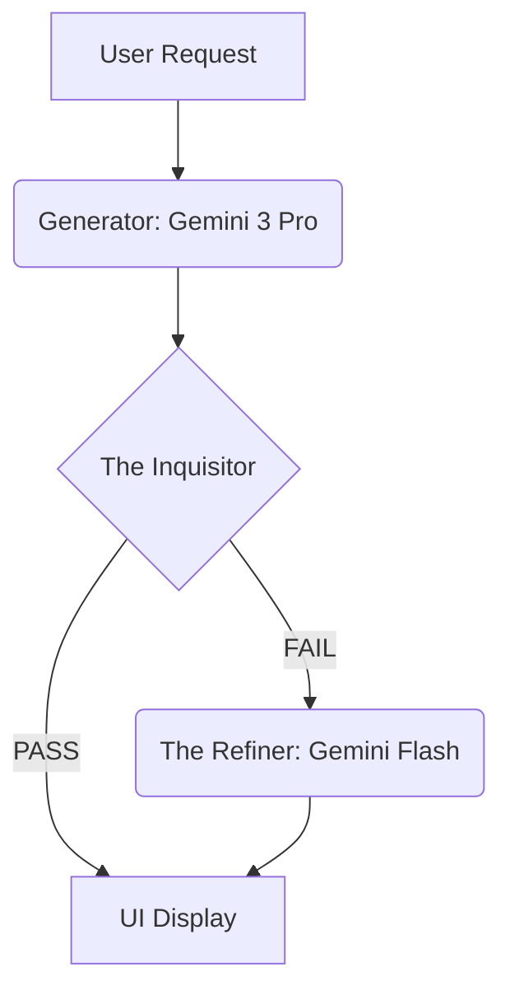

# AGENTIC WORKFLOW (V8.0)

> **Status**: ONLINE
> **Component**: `services/ai/agents.ts`

## Overview
As of Protocol V8.0, Pyrite's Sonic Forge no longer relies on a single "Shot" to generate prompts. Instead, it employs an **Agentic Loop** (Generator -> Critic -> Refiner) to ensure the output strictly adheres to Suno V4.5 constraints before reaching the user interface.

## The Agents

### 1. The Artist (Generator)
- **Model**: `gemini-3-pro-preview` (Thinking)
- **Role**: Creative architecture, "Vibe" selection, Structural planning.
- **Budget**: 24k - 32k tokens.

### 2. The Inquisitor (Critic)
- **Model**: `gemini-2.5-flash` (High Speed)
- **Role**: Quality Assurance.
- **Checklist**:
    - Are Tags < 400 characters?
    - Are Tags lowercase?
    - Are Lyrics < 3000 characters?
    - Are Syntax Brackets `[]` correct? (No `(Verse 1)` allowed).
    - Is the Title < 80 characters?
- **Output**: Boolean `pass` and array of `issues`.

### 3. The Refiner
- **Model**: `gemini-2.5-flash`
- **Role**: Surgical repair.
- **Trigger**: Only activated if The Inquisitor finds specific issues.
- **Context**: Receives the Draft JSON + List of Issues.
- **Action**: Rewrites *only* the problematic fields while preserving the creative intent.

## The Pipeline

## Failure Modes
If the Refiner fails or the API errors during the agentic loop, the system falls back to returning the original Draft (with basic regex sanitization applied) to prevent UI lockup.
